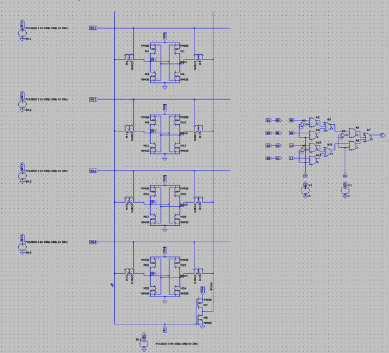
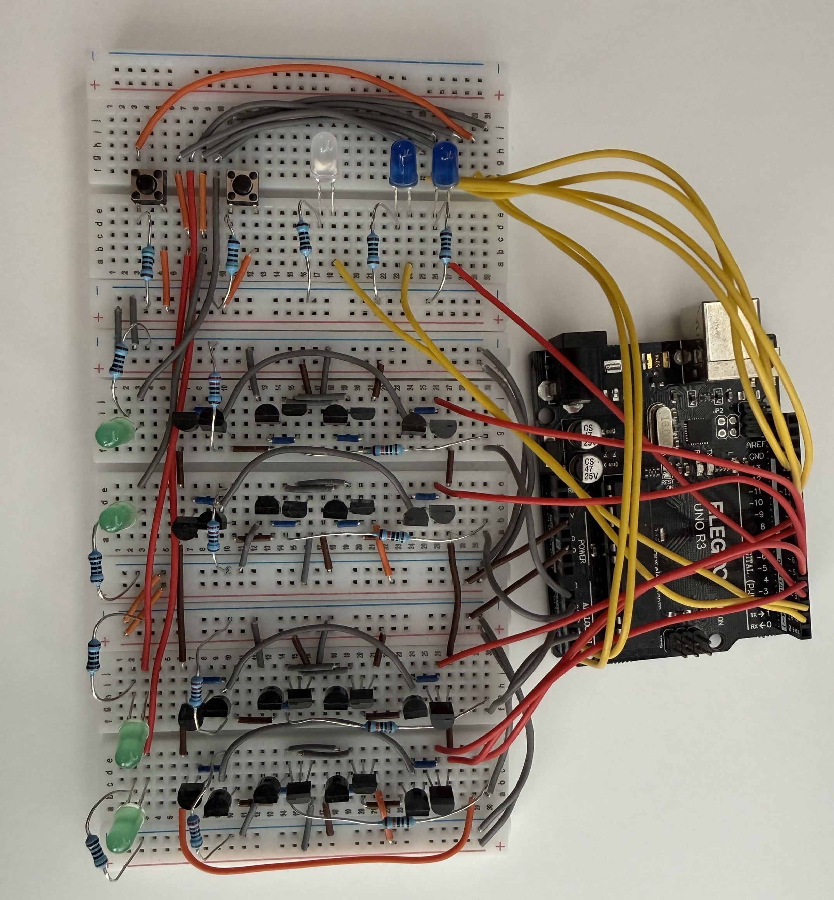

# Transistor-Level FPGA LUT

A transistor-level **2-input programmable lookup table (LUT)** designed and simulated in **LTspice**.

## Project

### LTspice Schematic

### Hardware Setup

## Overview

This project demonstrates how a basic FPGA LUT can be built from CMOS transistors.

The LUT uses:

- Four **6T CMOS SRAM cells** to store a 4-bit truth table
- A **4:1 multiplexer** to select the correct stored output
- `BL` and `BL̅` signals to program the SRAM cells
- Address and write-enable signals to control programming
- An **Arduino-based test loop** to control timing and verify operation

## How It Works

A 2-input LUT has four possible input combinations:

| A | B | Output |
|---|---|---|
| 0 | 0 | LUT[0] |
| 0 | 1 | LUT[1] |
| 1 | 0 | LUT[2] |
| 1 | 1 | LUT[3] |

Each output value is stored in one SRAM cell.

The two inputs, `A` and `B`, control the 4:1 multiplexer, which selects the corresponding SRAM value.

Changing the values stored in SRAM changes the logic function without changing the circuit.

For example:

| Function | LUT Values |
|---|---|
| AND | `0001` |
| OR | `0111` |
| XOR | `0110` |
| NAND | `1110` |

## Programming

The SRAM cells are programmed using `BL`, `BL̅`, write-enable, and address signals.

The Arduino controls the programming sequence and then applies LUT inputs to test the stored logic function.

## Verification

LTspice simulations were used to verify:

- SRAM programming
- SRAM data retention
- Correct multiplexer selection
- Correct LUT outputs
- Reprogramming between different logic functions

## Tools

- LTspice
- Arduino
- Python
- CMOS digital logic
- 6T SRAM
- FPGA LUT architecture

## What This Project Demonstrates

`MOSFETs → SRAM → Multiplexer → Programmable LUT`

The project provides a transistor-level view of how programmable FPGA logic works.
